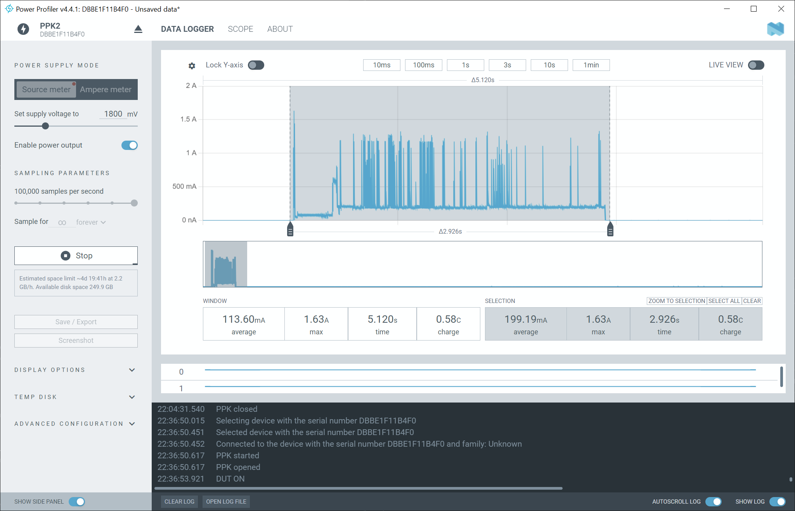

# XIAO Soil Moisture Sensor — low-power ESPHome firmware

Replacement ESPHome firmware for the [Seeed XIAO Soil
Sensor](https://www.seeedstudio.com/XIAO-Soil-Sensor-p-6452.html). It reports
soil moisture to Home Assistant over MQTT, then returns to deep sleep.

The kit ships with firmware that works. This firmware replaces it to solve one
problem: battery life.

| | Stock firmware | This firmware |
|---|---|---|
| Awake time per wake | `run_duration: 120s` | **~2.8 s** |
| Transport | native API | MQTT, retained topics ([why](#why-this-firmware-uses-mqtt)) |
| Address | DHCP | static IP + `fast_connect` |
| Sleep schedule | 8 h / 1 h / 15 min | 2 h / 1 h / 4 h |
| Battery percentage | linear 1.2–1.5 V, every 5 s | alkaline curve, sampled before WiFi |
| Bad sensor data | reported as `Normal Moisture` | `Sensor Fault` state, retry in 1 h |
| Wake energy | — | **0.158 mAh**, measured |
| Standby current | — | **92 µA**, measured |
| Life on one AA | about 1 month, observed | **about 600 days** at the Normal interval |

The awake time controls the battery life. The stock firmware holds the radio on
for 120 seconds at every wake. It does this even after the report is complete.
This is the main cause of the short battery life.

**About the one-month figure.** That is what this deployment observed with the
factory configuration. It is not a vendor specification. Seeed publish no
runtime figure for the product. The cause is visible in their published YAML:
`run_duration: 120s`.

Every power number here is measured with a hardware power analyzer, and the
tools to repeat the measurement are in this repository. Refer to
[docs/power.md](docs/power.md).

## Contents

| Path | Purpose |
|---|---|
| `esphome/` | The firmware. This directory is the ESPHome configuration root. |
| `esphome/packages/` | Shared base configuration and C++ helpers |
| `esphome/sample-with-button.yaml` | Device sample for a board with the CN4 button |
| `esphome/sample-timer-only.yaml` | Device sample for a board with CN4 removed |
| `tools/soil-ota-babysitter.py` | Unattended OTA updates for devices that sleep |
| `tools/ppk2-monitor.py`, `tools/analyze-capture.py` | Power measurement |
| `homeassistant/soil-alerts.yaml` | Sample alerts, not tied to any notify service |
| `docs/power.md` | Measurement method, evidence, and how to repeat it |
| `docs/hardware-notes.md` | A hardware defect that empties batteries |

## Hardware

| Part | Link |
|---|---|
| XIAO Soil Sensor (carrier and probe) | https://www.seeedstudio.com/XIAO-Soil-Sensor-p-6452.html |
| Product wiki, with the factory YAML under Resources | https://wiki.seeedstudio.com/xiao_soil_moisture_sensor/ |
| Seeed Studio XIAO ESP32-C6 | https://www.seeedstudio.com/Seeed-Studio-XIAO-ESP32C6-p-5884.html |
| XIAO ESP32-C6 wiki | https://wiki.seeedstudio.com/xiao_esp32c6_getting_started/ |

You supply one alkaline AA (LR6) cell. The carrier has a boost converter, which
keeps the device alive down to about 0.9 V.

**The external u.FL antenna is already attached. Keep it connected.** Each
failed association keeps the radio on, and radio time is the whole power
budget. If you remove the antenna, set `external_antenna: "false"` in your
device file. The firmware then selects the built-in ceramic antenna. A radio
that drives an unconnected u.FL connector is the worst of the three states.

## Prerequisite: MQTT

The stock firmware uses the ESPHome native API, which needs no setup. This
firmware uses MQTT, which needs a broker. Many Home Assistant users do not have
one yet, so this section gives the reasons, and then the setup.

### What the native API does correctly

One common belief about deep sleep is wrong, so read this first.

**The native API keeps the last reading on the dashboard while the device
sleeps.** The `deep_sleep` component sets a `has_deep_sleep` flag in the device
info. It also sends a disconnect request before each sleep. Home Assistant then
sees a planned disconnect from a sleepy device, and holds the entities available
with their last values. The rule is four lines in
[`esphome/entity.py`](https://github.com/home-assistant/core/blob/dev/homeassistant/components/esphome/entity.py):

```python
if self._device_info.has_deep_sleep:
    # During deep sleep the ESP will not be connectable (by design)
    # For these cases, show it as available
    self._attr_available = entry_data.expected_disconnect
```

Many battery devices use the native API and work well. "The entities go
unavailable between reports" is therefore **not** a reason to select MQTT. The
reasons below are.

### Why this firmware uses MQTT

**1. The device must not wait for a server to call it.** This is the strongest
reason. The native API is a **server on the device**: ESPHome opens port 6053
and waits, and Home Assistant is the client that connects to it. The ESPHome
[API documentation](https://esphome.io/components/api/) calls it "the port to
run the API server on". The Home Assistant [ESPHome
integration](https://www.home-assistant.io/integrations/esphome/) says that
"Home Assistant maintains a persistent connection to each ESPHome device".

That model is backwards for a battery device. The device cannot send a reading
until a client arrives. Each wake therefore holds the radio on for a delay that
the device does not control, and radio time is the whole power budget. Two more
details show the same shape: the report must start from an
`api.on_client_connected` trigger, and the API `reboot_timeout` exists to reboot
a device that no client called (default 15 minutes).

Home Assistant reconnects fast when mDNS works, and the delay is often small.
But the device pays for every slow case: a busy or restarted Home Assistant, a
lost mDNS packet, or a Wi-Fi network that blocks multicast. With MQTT the device
connects, publishes and sleeps on its own schedule. This project has not
measured the native API path on this hardware, so no number is given here.

**2. Remote commands need a retained message.** The device is awake for about
3 seconds, at a moment that it selects. A command must already wait for it. The
broker holds a retained message, and it delivers that message when the device
subscribes. This firmware uses the mechanism twice today, for the OTA hold flag
of the babysitter and for the calibration command. Two more use the same channel
in the plan: the sleep schedule as a retained command, and a next sleep duration
from Home Assistant as a live answer. Refer to [What is
planned](#what-is-planned). The ESPHome [deep sleep
documentation](https://esphome.io/components/deep_sleep/) recommends the same
MQTT method for OTA. The native API has no equivalent. A device can import a
Home Assistant entity state, but only after Home Assistant connects to it, which
is the wait that point 1 describes.

**3. The dashboard keeps its values after a restart of Home Assistant.** The
retention rule above is a property of a live connection. A restart clears it,
because `expected_disconnect` starts at `False` and no state has arrived yet.
ESPHome entities also do not restore their last value from disk. They therefore
read `unavailable` until the device wakes again. With the default intervals that
is a gap of up to 4 hours. Retained MQTT values come back in seconds.

The ESPHome integration has **no option** to change this. The only
workaround is one trigger-based template sensor per entity, because those do
restore their state. That is boilerplate for every entity of every device, and
the entity ids then change.

**4. Retain is a rule of the protocol, not a flag in an integration.** Point 3
shows that the API rule is delicate. It has also broken before: in Home
Assistant 2023.4
([#90923](https://github.com/home-assistant/core/issues/90923)), and again until
2025.5.2 ([#144970](https://github.com/home-assistant/core/pull/144970)). A
retained message needs no such logic.

**5. A report can survive a restart of Home Assistant.** This one is minor, and
it depends on your installation. On Home Assistant OS the broker add-on is a
separate container, so it stays up while Home Assistant Core restarts. A device
that wakes in that minute still delivers its reading, and Home Assistant reads
it when it subscribes again. With the native API that report is lost, and the
next one comes hours later. Most people restart Home Assistant rarely, so do not
weigh this heavily.

### When the native API is enough

MQTT is not mandatory. Use the native API instead if all of these are true:

- You want the readings on a dashboard, and nothing more.
- You accept a gap after each restart of Home Assistant.
- You do not need remote calibration, the OTA babysitter, or the planned
  interval commands.

That configuration needs an `api:` block, no `mqtt:` block, and a start of the
report script from `api.on_client_connected` instead of `wifi.on_connect`. Keep
mDNS enabled, or Home Assistant falls back to a slow retry timer. This
repository does not ship a sample for it.

### How to set it up

1. Install the **Mosquitto broker** add-on. The [Home Assistant MQTT
   documentation](https://www.home-assistant.io/integrations/mqtt/) recommends
   it, and Home Assistant generates the credentials for you.
2. Add the **MQTT integration**. Discovery is on by default. Discovery creates
   all the entities of this firmware without more configuration.
3. Put the broker address, the user name and the password into `secrets.yaml`.

Refer also to the [ESPHome MQTT client
documentation](https://esphome.io/components/mqtt/).

### Settings that look wrong, but are correct

The `mqtt:` block in the base package is tuned for deep sleep:

- `birth_message`, `will_message` and `shutdown_message` are **empty**, which
  disables them. ESPHome sends `online` to `<topic>/status` by default, and asks
  the broker to send `offline` when the connection drops. Home Assistant reads
  that topic as availability, so every deep sleep would mark all entities
  unavailable. Retained values alone survive; availability must be disabled.
- `enable_on_boot: false`, and `wifi.on_connect` starts MQTT instead. This skips
  the 5 second retry gate of the MQTT client. That gate alone is longer than the
  whole target wake time.
- `reboot_timeout: 0s`, so a broker outage does not restart the device.
- `on_connect` runs the report script, so the wake is connect, publish, sleep.

> **Trap.** If you enable MQTT and do not use the native API, you must remove
> `api:` or set `api.reboot_timeout: 0s`. If you do not, the device restarts
> every 15 minutes, because no client connects to the API. This configuration
> has no `api:` block, so it is already correct. On a battery device a
> 15 minute restart cycle empties the cell.

## Quick start

```bash
git clone https://github.com/CrazyCoder/xiao-soil-moisture-esphome.git
cd xiao-soil-moisture-esphome/esphome
cp secrets.yaml.example secrets.yaml
```

Edit `secrets.yaml` and enter your WiFi and MQTT values. Then copy a sample for
your first plant:

```bash
cp sample-with-button.yaml plant-1.yaml
```

Edit `name`, `friendly_name` and `static_ip` in that file. Give every device a
different name and a different address. Then connect the board over USB and
flash it:

```bash
# Linux / macOS
esphome run plant-1.yaml --device /dev/ttyACM0
```

```powershell
# Windows (PowerShell). Read "Windows notes" below first.
esphome run plant-1.yaml --device COM11
```

Wait for the green LED before you flash. The LED means the device is awake and
its port is present. Hold BOOT while you connect the cable only if no port
appears, because a device in deep sleep does not enumerate its USB interface.

Later updates go over the network. Refer to [How to update the
firmware](#how-to-update-the-firmware).

Use `sample-timer-only.yaml` instead if the CN4 button is absent from your
board.

The samples enable the rewake guard. Set this optional substitution to start
with the guard off:

```yaml
substitutions:
  rewake_guard_default: "false"
```

This value seeds a device with no saved control value. It is also the target of
the MQTT `RESET` command below.

### Windows notes

**Build from PowerShell or the Command Prompt.** If you do that, the rest of this
section does not affect you.

The trap below applies only to a shell of the MSYS family: Git Bash, an MSYS2
terminal, or any terminal that puts `Git\usr\bin` on the `PATH`. Some editors
and agent tools also use Git Bash as their default shell.

ESP-IDF refuses to build under MSYS or MinGW. If `MSYSTEM` is set, or if
`Git\usr\bin` is on the `PATH`, ESP-IDF detects an MSYS environment and skips
the link step. **ESPHome then still prints `Successfully compiled program` and
exits 0.** It produces no binary. A later `upload` flashes an old binary, or it
fails for a reason that makes no sense.

The warning appears earlier in the output:

```
MSys/Mingw is no longer supported. Please follow the getting started guide ...
WARNING flasher_args.json not found, cannot create factory.bin
WARNING Firmware not found: ...
```

If you see `Firmware not found` or `ELF not found`, the build failed. Do not
trust the success line above it.

To find your COM port:

```powershell
Get-CimInstance Win32_SerialPort | Select-Object DeviceID, Description
```

The XIAO ESP32-C6 uses the native USB-Serial-JTAG interface. It appears as
`COMn` on Windows, and as `/dev/ttyACM0` on Linux.

## Power design

The levers, in order of effect.

1. **Short awake time.** The device reports and then sleeps, instead of a fixed
   `run_duration`. This is the 40x lever. Everything below is smaller.
2. **MQTT, not the native API.** The device connects to the broker, publishes,
   and sleeps. With the native API the device must stay awake until Home
   Assistant opens the connection to it. MQTT also starts from
   `wifi.on_connect`, which skips a 5 second retry gate. Refer to [Why this
   firmware uses MQTT](#why-this-firmware-uses-mqtt).
3. **A static IP with `fast_connect`.** DHCP costs seconds of radio time at
   every wake.
4. **The supplied u.FL antenna.** Keep it connected. Fewer retries means a
   shorter wake.
5. **Sleep intervals that follow the moisture state.** Refer to [Sleep
   schedule](#sleep-schedule).
6. **The probe drive stops immediately after the sample.** It also stops during
   a USB session and an OTA hold.
7. **A battery percentage from an alkaline curve**, sampled before WiFi starts.
   Refer to [The battery percentage](#the-battery-percentage).
8. **A rewake guard.** Water on the button can wake the device continuously.
   One wet button emptied a full cell in about two hours. By default, five
   reported button wakes cause one timer-only sleep. You can disable this guard.
   A separate no-report backstop always protects a device that cannot reach MQTT.



One wake: 2.926 seconds, 199.19 mA average, 0.58 C. The 1.63 A peak is the
radio start.

## Sleep schedule

The interval chosen from the **current** reading controls how fast the **next**
change is found. That is the logic behind these defaults.

| Current state | Sleep | Wakes/day | What it buys | Life on 2500 mAh |
|---|---:|---:|---|---:|
| Normal Moisture | 2 h | 12 | Find Almost Dry within 2 h | ~608 days |
| Almost Dry | 1 h | 24 | Find Dry within 1 h | ~416 days |
| Dry | 4 h | 6 | Confirm watering within 4 h | ~791 days |

A plant is watered at most once a day, and Home Assistant keeps the Dry state.
A short Dry interval therefore only confirms the recovery faster. It does not
find the entry into Dry any sooner. The budget belongs on the Normal interval,
where it halves the early warning time.

**These values are one household's compromise. Change them for your plants.**
Set them in your device file:

```yaml
substitutions:
  sleep_normal_ms:     "7200000"    #  2 h
  sleep_almost_dry_ms: "3600000"    #  1 h
  sleep_dry_ms:       "14400000"    #  4 h
```

Calculate the cost first: `wakes per day = 86400 / (interval_ms / 1000)`. Each
wake costs 0.158 mAh. The stock 15 minute Dry interval is 96 wakes each day,
and it spends the charge after the alert has already gone out.

### Why the device has no clock

The device does not know the time of day. This is deliberate.

A clock needs a time source and a synchronisation at each wake. Both cost awake
time, and awake time is the whole power budget. The device must also hold the
time across deep sleep.

The gain is small. A plant does not dry to a schedule, and the interval logic
above already reacts to the measurement itself. A fixed 2.8 second wake with no
clock is a better trade than a shorter interval at night.

### What is planned

Neither of these is in the firmware today. A change to an interval needs a new
build and an OTA update.

**1. Remote interval settings.** A retained MQTT command will set the three
fallback intervals with no new build:

```sh
mosquitto_pub ... -r -t 'plant-1/sleep_schedule/command' -m 'SET 7200 3600 14400'
```

It follows the pattern of the calibration command below. The device validates
all three values together, rejects a bad command, and clears the retained
command itself.

**2. A sleep time from Home Assistant.** Home Assistant holds the full history
of each plant, with accurate timestamps. It can estimate how fast each pot
dries. It can therefore choose a better next sleep than a fixed table can, and
it can do that per plant.

The device would publish its reading, wait a short time for a live MQTT answer,
and accept one bounded duration for that wake only. **This is a message, not a
firmware update.**

Safety rules for that design:

- The answer is **not retained**. A stale duration cannot replay after a
  restart of the broker, the device or Home Assistant.
- The device clamps the value to a safe minimum and maximum. An accidental one
  second interval cannot empty the cell.
- On a timeout, a bad value, or no answer, the device uses its own saved
  schedule.
- The device publishes the applied duration and the reason for it, so you can
  audit the decision.

The device therefore stays autonomous. Home Assistant only advises it.

## The battery percentage

The stock firmware maps the voltage to a percentage with a straight line:

```cpp
if (x < 1.2)      { return 0.0; }
else if (x > 1.5) { return 100.0; }
else              { return ((x - 1.2) / (1.5 - 1.2)) * 100.0; }
```

This has two faults:

1. **An alkaline cell does not discharge in a straight line.** A new cell holds
   100% for several weeks. It then crosses the whole scale in about twelve days.
2. **It calls 1.2 V empty.** At 1.2 V under this load, about 24% of the usable
   service remains. The boost converter also runs down to 0.9 V. The stock map
   reports a dead battery while a quarter of the charge is still available.

This firmware publishes the raw voltage and calculates the percentage from a
lookup table:

| Cell voltage | 1.60 | 1.50 | 1.40 | 1.30 | 1.20 | 1.10 | 1.00 | 0.90 |
|---|---:|---:|---:|---:|---:|---:|---:|---:|
| Reported % | 100 | 96 | 83 | 57 | 24 | 11 | 3 | 0 |

The table comes from the **Duracell Basic AA (MN1500 / LR6)** datasheet,
document `MN15EUBS0919`, and its **50 mW** constant-power curve. That is the
lightest curve Duracell publish for an AA cell, and this device averages about
0.26 mW. The better known Coppertop datasheet stops at 250 mW, which is almost
1000 times the real load. Refer to [docs/power.md](docs/power.md#which-curve-and-why)
for the chart and the full explanation.

The firmware samples the voltage once at boot priority 599. That point is after
the ADC is ready, but before WiFi starts, and after hours of sleep. This removes
the ±10% swings that the radio load caused.

The percentage is an estimate, not a fuel gauge. Use it for alerts. Use the raw
voltage to diagnose one cell. Refer to [docs/power.md](docs/power.md).

## Fault detection

The stock firmware cannot report a broken sensor. Its classification ends with
an `else` branch that returns `Normal Moisture`:

```cpp
if (value >= ...)       return "Dry";
else if (value > ...)   return "Almost Dry";
else                    return "Normal Moisture";     // every failure lands here
```

Two failures land in that `else`:

- **A failed ADC read gives NaN.** In C++ every comparison with NaN is false, so
  the code reaches the `else`.
- **Invalid calibration gives a meaningless threshold**, and the comparisons
  fail in the same way.

The device then reports a healthy plant and sleeps for 8 hours. The dashboard
stays green while the plant dries out. This is the worst failure a moisture
sensor can have, because it looks exactly like success.

This firmware checks the reading and the calibration first. Bad data becomes a
separate **`Sensor Fault`** state, and the device retries after one hour instead
of its normal interval. The `Soil sensor fault` entity uses
`device_class: problem`, so Home Assistant shows it as a problem, and the sample
alerts report it.

A real example from this fleet: one unit held a saved calibration of dry
2.590 V and wet 2.591 V. The span was -0.001 V, so dry was below wet, which is
impossible. The stock logic returns `Normal Moisture` for that state. This
firmware reported a fault instead, and a retained calibration command repaired
the unit at its next wake.

Calibration is protected in the same way. A failed calibration keeps the last
known good pair, so a bad second phase cannot overwrite good values.

## Runtime controls

Firmware 1.3.0 adds one generic command topic for persistent device controls.
Firmware 1.4.0 also exposes **Rewake guard** as a switch in the device's
Home Assistant controls. Turn it off for repeated manual checks, or turn it
back on for the safe default. The switch command is retained, so a sleeping
device applies it on its next wake.

The generic MQTT command remains available for scripts and other controllers.
Use a retained message, because the device can be asleep:

```sh
# Disable the rewake guard:
mosquitto_pub -h BROKER -u USER -P PASS \
  -r -t 'plant-1/settings/command' -m 'SET REWAKE_GUARD OFF'

# Enable the rewake guard:
mosquitto_pub -h BROKER -u USER -P PASS \
  -r -t 'plant-1/settings/command' -m 'SET REWAKE_GUARD ON'

# Restore the compiled rewake_guard_default:
mosquitto_pub -h BROKER -u USER -P PASS \
  -r -t 'plant-1/settings/command' -m 'RESET REWAKE_GUARD'
```

The stable grammar is `SET <name> <value>` or `RESET <name>`. Future persistent
controls will use this topic and grammar.

The device validates the full command and saves an accepted value in flash.
It then reports the effective value and clears the retained command. A bad
command changes nothing.

The saved value survives deep sleep and battery removal. It has precedence
over `rewake_guard_default` until the next `SET` or `RESET`.

`OFF` disables the timer-only sleep after five completed button wake reports.
The `Button wake count` entity still reports all button wakes.

The separate hard backstop cannot be disabled. It acts after ten GPIO wakes
that fail to complete an MQTT report. This stops a wet-button loop when WiFi or
MQTT is unavailable.

## Calibration

Calibration sets the dry voltage and the wet voltage of your probe. Both values
are kept in the flash memory of the device.

**With the button.** Press the button 3 times quickly. The red phase starts:
hold the probe in dry soil for 10 seconds. The green phase then starts: hold the
probe in the soil immediately after you water it, for 10 seconds. The firmware
checks both values before it saves them, so a bad second phase cannot overwrite
a good pair.

**Over MQTT.** This also works on a board with no button:

```sh
# Restore the configured seed values:
mosquitto_pub -h BROKER -u USER -P PASS \
  -r -t 'plant-1/calibration/command' -m RESET

# Apply your own measured values. Dry must be at least 0.150 V above wet:
mosquitto_pub -h BROKER -u USER -P PASS \
  -r -t 'plant-1/calibration/command' -m 'SET 2.750 1.200'
```

The command is retained, so the device receives it at its next wake. The device
checks the command, saves the values, takes a fresh reading, publishes the
result, and then clears the retained command itself. A bad command is rejected
and the stored values do not change.

`RESET` restores the seed values. It is not a substitute for a real
per-probe calibration.

## Home Assistant

MQTT discovery creates these entities for each device:

| Entity | Purpose |
|---|---|
| Soil Moisture Status | Dry, Almost Dry, or Normal Moisture |
| Soil moisture (raw) | Probe voltage. Higher is drier. |
| Battery | Percentage from the alkaline curve |
| Battery voltage | Raw cell voltage. Use this to diagnose a cell. |
| Soil sensor fault | Problem class. On for a bad ADC or bad calibration. |
| Button wake count | Consecutive button wakes. Above 2 means a wet button. |
| USB hold | Shows if a USB host keeps the device awake |
| WiFi signal | Signal strength in dBm |
| MCU temperature | Die temperature, sampled before WiFi starts |
| Calibration dry / wet / span | The stored calibration |
| Calibration command result | Result of the last calibration attempt |
| Rewake guard | Config switch for the effective persistent `ON` or `OFF` value |
| Settings command result | Result of the last runtime control command |
| Next sleep | The interval chosen at this wake |
| Wake reason / Reset reason | Timer, button, or cold boot |
| Firmware build | Exact version and configuration hash |

`Calibration command result` stays `unknown` until you calibrate. It reports the
last operation. It is not a health sensor.

`Settings command result` stays `unknown` until the first runtime control
command. Invalid commands appear there, but they do not change the saved value.

Sample alerts are in
[`homeassistant/soil-alerts.yaml`](homeassistant/soil-alerts.yaml): battery low,
button wet or stuck, sensor fault, plant needs water, and sensor silent. They
use a placeholder notify service, so they work with any notification method.

## How to update the firmware

A device that is awake for 2.8 seconds every two hours is not a normal update
target. There are three methods.

### The USB hold

`packages/usb_host_detect.h` reads the USB-Serial-JTAG frame counter twice,
20 ms apart. An enumerated USB host sends SOF frames at 1 kHz. The count between
the two reads must therefore agree with a 20 ms interval. The check accepts only
a count in that range, and it does the test across two sequential windows. A
charger or a power bank never sends SOF frames. The check therefore answers "is
a real host attached?", not "is there 5 V?".

When a host appears, the firmware stops the deep sleep and **turns on the green
LED**. The LED means "I am awake, flash me now". When you disconnect the cable,
the device returns to its schedule. Without this hold you must complete a flash
inside a 2.8 second window.

The hold also has a 5 minute timeout. At each timeout the firmware does the test
again. A host that stays connected sets the hold again. If no host is present,
the device returns to its schedule.

> **The count check and the timeout are necessary.** A USB hold cancels the
> `run_duration` limit permanently, and no other limit applied before firmware
> 1.5.2. One bad read of the counter could therefore hold a node awake at full
> radio power until the cell was empty. A node that never sleeps also never
> reports, so the fault gave no alert.

### Method A: USB

This is the simplest method. It is also the only method for the first flash from
the stock firmware.

Connect the cable, wait for the green LED, then flash the device:

```bash
esphome run plant-1.yaml --device /dev/ttyACM0    # Linux / macOS
esphome run plant-1.yaml --device COM11           # Windows
```

Disconnect the cable when the flash is complete. The device then returns to its
schedule. On Windows, read [Windows notes](#windows-notes) first.

**You do not need the BOOT button while the device is awake.** The green LED
means the USB hold is active. The port is then present, and ESPHome puts the
chip into download mode itself.

**Hold BOOT only if no port appears.** A device in deep sleep does not enumerate
its USB interface. There is no port until it wakes. Hold BOOT while you connect
the cable. This starts the ROM bootloader, which always enumerates.

### Method B: manual OTA

Use this for one deployed device.

```bash
# 1. Retained hold. The device stays awake after its next wake.
mosquitto_pub -h BROKER -u USER -P PASS -r -t 'plant-1/ota' -m ON

# 2. Wake it: press the button once, or wait for the next report (up to 4 h).

# 3. Upload once the device answers.
esphome upload plant-1.yaml --device 192.168.1.61

# 4. VERIFY the running build.
mosquitto_sub -h BROKER -u USER -P PASS \
  -t 'plant-1/sensor/firmware_build/state' -C 1 -W 10

# 5. Release the hold. The device sleeps immediately.
mosquitto_pub -h BROKER -u USER -P PASS -r -t 'plant-1/ota' -m OFF
```

> **Step 4 is not optional.** The bootloader reverts an image that is not marked
> valid before the next restart. A deep-sleep device restarts constantly.
> This firmware marks itself valid after one complete report. The message
> "OTA successful" from the uploader only means that the bytes arrived.

> **A retained `ON` that you forget empties the battery**, because it holds the
> device awake. Always do step 5. The firmware clears a hold after 10 minutes as
> a backstop. An upload takes seconds, so this limit is sufficient.

### Method C: the babysitter

`tools/soil-ota-babysitter.py` does method B for several devices at the same
time. For each device it does five steps: hold the device awake, wait for the next
natural wake, upload, verify the exact version and configuration hash, then
release the hold. The release is guaranteed through `finally`, signal handlers and
`atexit`, because a forgotten hold costs a battery.

The script compiles every selected device **before** it sets any hold. A failed
build therefore leaves every device that sleeps untouched.

Setup on a new Linux system:

```bash
# 1. Prerequisites (Debian or Ubuntu)
sudo apt install -y git tmux
curl -LsSf https://astral.sh/uv/install.sh | sh

# 2. Configuration and secrets
git clone https://github.com/CrazyCoder/xiao-soil-moisture-esphome.git
cd xiao-soil-moisture-esphome/esphome
cp secrets.yaml.example secrets.yaml
$EDITOR secrets.yaml

# 3. ESPHome itself. The script calls it.
uv tool install esphome

# 4. Run it under tmux. A run can wait hours for a device to wake.
tmux new -s soil-ota \
  'ESPHOME_CONFIG_DIR=$PWD uv run ../tools/soil-ota-babysitter.py plant-1 plant-2 2>&1 | tee -a ~/soil-ota.log'
```

The script finds the devices itself. It reads the `name` and `static_ip` values
from every device file in the configuration directory. Select devices by name
(`plant-1`), by number (`1`), or with `all`.

Two requirements: the machine must reach both the MQTT broker and the addresses
of the devices, so run it on the same network. The wake timeout is 6 hours,
against a longest schedule of 4 hours.

A device that cannot reach the broker increases its own sleep time, to a maximum
of 6 hours. Such a device can miss that timeout during a network outage. Press
its button to wake it, or start the script again.

The script publishes each result to `soil-ota-babysitter/notification`. Home
Assistant can forward that topic to any notification service.

## Verify the power numbers

The measurements use a [Nordic Power Profiler Kit II
(PPK2)](https://www.nordicsemi.com/Products/Development-hardware/Power-Profiler-Kit-2),
a USB power analyzer. It supplies the board and measures from 200 nA to 1 A at
100,000 samples per second. **You do not need one to use this firmware.** It is
only for a measurement or a diagnosis.

A pass or fail check takes about 55 seconds:

```bash
uv run tools/ppk2-monitor.py diag --label "plant 1"
```

Refer to [docs/power.md](docs/power.md) for the connections, the method, the
full results and the cautions.

## A hardware defect that empties batteries

Some units lose a battery in weeks. The cause is not the firmware. On the
carrier board the BAT+ pad is 0.54 mm from the GPIO2 wake pin at the CN4
button. Water reaches the button through the enclosure.

The leakage resistance decides the symptom. A low resistance makes the switch
look pressed, so the device wakes again at every sleep. A higher resistance
gives no false wakes, but a constant standby current empties the cell.

**The damage is often invisible**, because water also gets inside the switch
body. A board that looks perfect can still leak. Measure it, do not inspect it.

The repair is to remove CN4. This returned three damaged units from 6.3x, 12.2x
and 22.8x the baseline standby current back to 88 µA, 92 µA and 163 µA.

Refer to [docs/hardware-notes.md](docs/hardware-notes.md) for the photographs,
the detection method and the repair.

## Notes and traps

- **`discovery_unique_id_generator: mac` is necessary.** The ESPHome default is
  `legacy`, which gives the same discovery id to every device. Home Assistant
  then ignores or cross-wires every device after the first one.
- **Verify a build from MQTT, not from the uploader.** Read
  `<node>/sensor/firmware_build/state`.
- **A network failure is safe.** These settings look wrong together, but each
  one protects the cell. The first three are substitutions, so you can change
  them in your device file.

  | Setting | Value | Purpose |
  |---|---|---|
  | `report_timeout_ms` | **20000** (20 s) | Ends a wake that does not reach the broker |
  | `max_awake_ms` | **1200000** (20 min) | Absolute limit on awake time. No hold can cancel it. |
  | `max_offline_sleep_ms` | `21600000` (6 h) | Maximum sleep after sequential failed wakes |
  | `deep_sleep.run_duration` | `30 s` | A one-shot timeout, not a limit. Refer to the caution. |
  | `wifi.reboot_timeout` | `0s` | No restart when WiFi fails |
  | `mqtt.reboot_timeout` | `0s` | No restart when the broker fails |
  | `wifi.ap.ap_timeout` | `5min` | Keeps the fallback hotspot out of a failed wake |

  On a battery device a restart is the dangerous answer and sleep is the safe
  one. A restart brings the radio back up to try again, at about 113 mA. The
  20 second timeout instead forces a sleep, and the device retries later.

  > **Caution. `run_duration` is not a safety limit.** ESPHome starts it one
  > time, at boot. Any hold cancels it permanently, because a hold calls
  > `prevent_deep_sleep()`. A USB session, an OTA hold or a calibration therefore
  > removes it for the remainder of that wake. `max_awake_ms` is the only limit
  > that a hold cannot cancel.

  A failed wake costs about 0.63 mAh, calculated from the measured wake current.
  The device also increases its sleep time after sequential failed wakes. The
  first failure keeps the usual interval. Each subsequent failure doubles it, to
  a maximum of eight times the interval or 6 hours. A cell therefore survives for
  months with WiFi switched off. A restart loop empties the same cell in about 22
  hours.

  A failure is therefore silent by design. The `Soil - sensor silent` sample
  alert makes it visible.

## Firmware versions

The version appears in the `sw_version` of the Home Assistant device, and on the
`Firmware build` entity with the exact configuration hash.

| Version | Change |
|---|---|
| 1.0 | Adaptive schedule, alkaline curve, voltage sampled before WiFi |
| 1.1.0 | MCU temperature |
| 1.2.0 | Remote calibration, exact build id, fault handling, diagnostics |
| 1.2.1 | Probe drive stops after 5 s when MQTT never connects |
| 1.2.2 | Publishes the healthy initial fault state instead of `unknown` |
| 1.2.3 | Sleep intervals and antenna choice became substitutions |
| 1.3.0 | Generic runtime controls and an optional rewake guard |
| 1.4.0 | Home Assistant config switch for the persistent rewake guard |
| 1.5.2 | Limits on the USB hold and on the awake time, and a `USB hold` entity |

Versions 1.5.0 and 1.5.1 were not released.

Versions follow SemVer. A patch fixes a fault with no change to behaviour or
entities. A minor version adds behaviour or entities.

## Credits and licence

MIT. Refer to [LICENSE](LICENSE).

The pin map and the PWM probe drive come from the factory ESPHome configuration
of Seeed Studio. That file is in the Resources section of the [product
wiki](https://wiki.seeedstudio.com/xiao_soil_moisture_sensor/). The rest of the
firmware is a rewrite.
