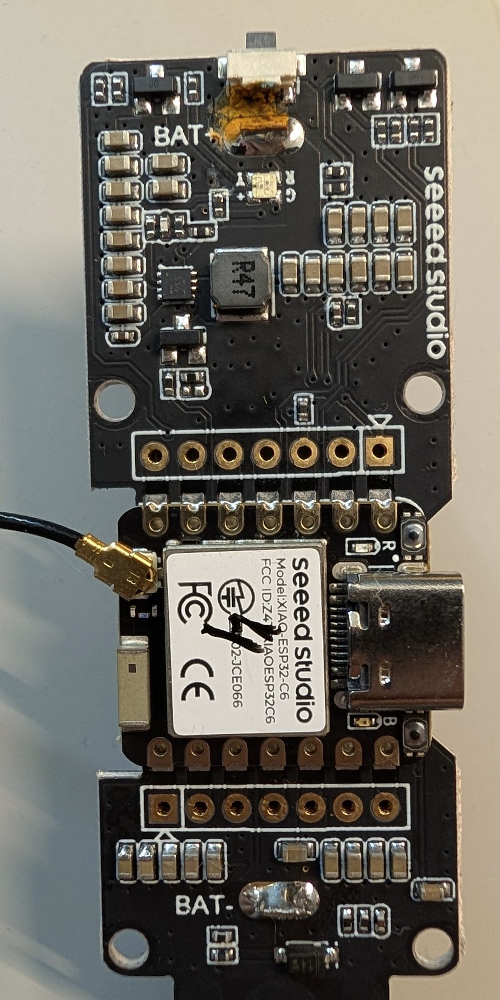
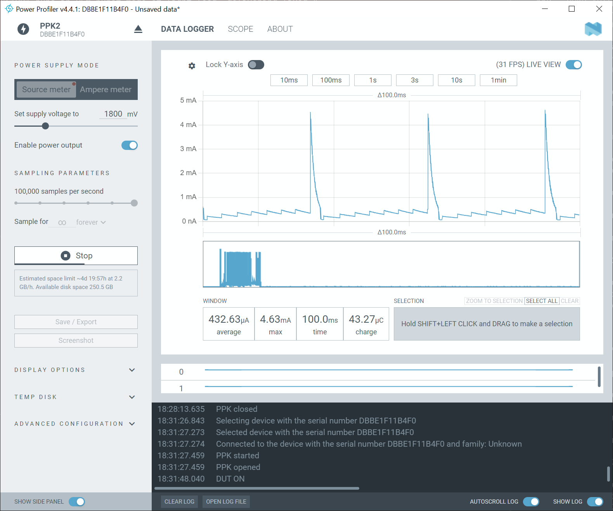

# Hardware notes: the CN4 button and water damage

Some units lose their battery in weeks, and other identical units run for more
than a year. The cause is a hardware defect, not the firmware. This document
tells you how to find the defect and how to repair it.

## The defect

On the carrier board, the BAT+ pad is 0.54 mm from the GPIO2 wake pin at the
CN4 button. The enclosure lets water reach the button when you water the plant.
Water and dissolved salts then make a leakage path.

Look at the top of the carrier board, at the white tactile switch. The corrosion
spreads from the switch over the BAT+ pad, and it covers the `+` of the
silkscreen. The result is a constant standby current. It is **not** a reboot
loop, and the wake path stays healthy.

> **The damage is often invisible.** The photo shows an obvious case. Water also
> gets inside the switch body, where you cannot see it. A board that looks
> perfect can still leak. **Do not clear a board by a visual check. Measure it.**

### Two failure modes

The resistance of the leakage path decides which fault you get:

| Leakage resistance | Effect |
|---|---|
| Low | The switch looks pressed. The device wakes again at every sleep. |
| Higher | No false wakes, but a constant standby current empties the cell. |

A low resistance path is the more visible fault, because `button wake count`
increases and the battery falls in hours. A higher resistance path is quiet: the
device reports normally, and only the battery life shows the problem.

The same repair fixes both faults, because both come from the same place.

The standby current is 54% of the power budget on a good device. On a damaged
device it is more than 95%. A leak therefore costs more than any firmware
change can save.

## How to detect it

### Without instruments

Two signs appear in Home Assistant:

- The battery percentage falls much faster than the wake count explains. Compare
  a suspect device to a known good device over the same period.
- The `button wake count` sensor increases on a device that nobody touched. Wet
  contacts close the button, and the button is also the deep-sleep wake pin.

The sample alerts in `homeassistant/soil-alerts.yaml` report both conditions.

### With a PPK2

Measure the standby current at 1800 mV. Refer to [power.md](power.md) for the
connections and the commands. This is the only reliable test, because the
damage inside the switch body is not visible.

This unit draws 432 µA against the 92 µA baseline, which is 4.7 times too much.
The sawtooth pattern is the normal burst mode of the boost converter. The 4.6 mA
peaks are the burst events.

### The diagnostic signature

The leak takes **constant power** across the supply voltage. The current
increases as the voltage falls, but the power stays within about 10%.

This tells you where the leak is. A resistive path across BAT+ behaves in the
opposite way, because its current falls with the voltage. Constant power puts
the leak after the boost converter, on the 3.3 V rail.

## How to repair it

Desolder CN4 completely.

These are the measured results on three damaged units:

| Before | After | Outcome |
|---|---|---|
| 6.3x baseline | 88 µA | At the pristine baseline |
| 12.2x baseline | 92 µA | At the pristine baseline |
| 22.8x baseline | 163 µA | Much better, but a small leak remains |

The removal of the button has one consequence. GPIO2 is no longer a wake source,
so the device wakes on its timer only. Use
[`esphome/sample-timer-only.yaml`](../esphome/sample-timer-only.yaml) for such a
board. That sample does not include the button package, so GPIO2 is neither an
input nor a wake pin.

You keep remote calibration. Refer to the calibration commands in the README.

**Measure again after 24 to 48 hours at ambient humidity.** Earlier repairs that
used heat alone became worse again after a day.

## How to clean the board

Use 99% or better isopropyl alcohol. Flush the area properly, or use an
ultrasonic bath. Dry the board warm, then measure the standby current again.

The measurement is a pass or fail test that takes 90 seconds. A leakage path of
a few kΩ either clears or it does not.

## Severity bands

The grade compares the measured standby current to the 92 µA baseline.

| Ratio | Verdict | Action |
|---|---|---|
| Below 1.25x | Healthy | Nothing |
| 1.25x to 2x | Acceptable | Use it, expect a shorter life |
| 2x to 4x | Marginal | Clean the board |
| 4x to 10x | Damaged | Clean the board, then remove CN4 |
| 10x or more | Severely damaged | Remove CN4 |

A clean board that still fails this test has damage inside the switch body.
Remove CN4. More alcohol cannot reach the contacts inside the switch.

## How to prevent it

Water the pot away from the sensor board. The probe must go into the soil, but
the board and the button must stay dry.
