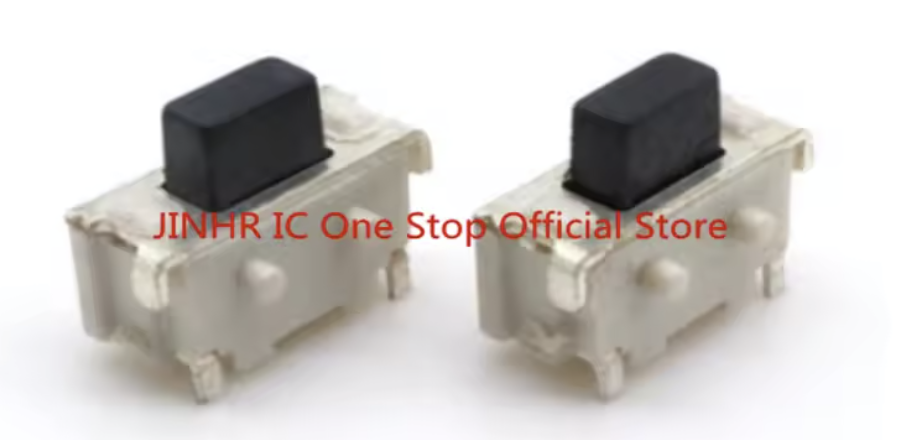

# Hardware notes: the CN4 button and water damage

Some units lose their battery in weeks, and other identical units run for more
than a year. The cause is a hardware defect, not the firmware. This document
tells you how to find the defect and how to repair it.

## The defect

On the carrier board, the BAT+ pad is 0.54 mm from the GPIO2 wake pin at the
CN4 button. The enclosure lets water reach the button when you water the plant.
Water and dissolved salts then make a leakage path.


Look at the top of the carrier board, at the white tactile switch. The corrosion
spreads from the switch over the BAT+ pad, and it covers the `+` of the
silkscreen.

The result is one of four faults. Most of them are a constant standby current,
and the wake path stays healthy. One of them makes the switch look pressed, so
the device wakes again at every sleep. Refer to
[Four failure modes](#four-failure-modes) below.

> **The damage is often invisible.** The photo shows an obvious case. Water also
> gets inside the switch body, where you cannot see it. A board that looks
> perfect can still leak. **Do not clear a board by a visual check. Measure it.**

### The circuit

The Seeed schematic and the KiCad netlist give this branch:

```text
3V3 ── R6 4.7 kΩ ── A2_D2 / GPIO2 ── CN4 switch ── GND
                          │
                         ED1  (ESD device)
                          │
                         GND
```

GPIO2 is the button input and the deep-sleep wake pin. The button pulls GPIO2 to
ground.

**R6 is a physical part on the carrier board.** No firmware change disconnects
it. The internal pull-up of the chip is therefore not the limit here.

Two numbers follow from that branch, and they explain every fault below:

- A full short from GPIO2 to ground draws `3.3 V / 4.7 kΩ` = **0.70 mA** from the
  3.3 V rail.
- GPIO2 reads LOW below about 0.25 x 3.3 V. R6 and the leak form a divider, so a
  leak below about **1.6 kΩ** looks like a pressed button.

### Four failure modes

| # | Leak path | Looks pressed? | Symptom | Electrical signature |
|---|---|---|---|---|
| 1 | GPIO2 to GND, below ~1.6 kΩ | **Yes** | False wakes, then the rewake guard. Hours of life. | Constant power, up to 0.70 mA on the 3.3 V rail |
| 2 | GPIO2 to GND, above ~1.6 kΩ | No | Silent standby drain | Constant power, falls as the leak resistance rises |
| 3 | BAT+ to GPIO2 (the 0.54 mm gap) | No | Silent standby drain | Constant power, up to 0.38 mA |
| 4 | BAT+ to BAT- (GND) | No | Direct drain of the cell | **Constant resistance** |

Modes 1 to 3 all load the **3.3 V rail**, so they take constant power. Mode 4
sits across the cell, before the boost converter, so it takes constant
resistance. The measurement in [power.md](power.md) separates them: sweep the
supply voltage and watch whether the power stays flat or the current falls.

Mode 3 is the path that the 0.54 mm gap creates. A bridge there holds GPIO2 near
the cell voltage of 1.5 V. That is above the logic threshold, so the button
never looks pressed, and current flows from the 3.3 V rail through R6 into the
cell.

Mode 1 is the only mode that `button wake count` reports. Modes 2, 3 and 4 are
silent, and only the battery life shows them.

**The same repair fixes modes 1, 2 and 3**, because all three end at the switch
or at its pads. ED1 sits on the same net, so it is a second possible source of
modes 1 and 2.

A measured example: unit 6 drew 1.45 mA at 1.8 V before repair. That implies a
leak of roughly 250 Ω to 540 Ω, which is close to a dead short across the
switch. CN4 removal returned it to the 92 µA baseline.

The mode table is a model with strong numerical support. Nobody has confirmed
the exact path inside each damaged unit.

The standby current is 54% of the power budget on a good device. On a damaged
device it is more than 95%. A leak therefore costs more than any firmware
change can save.

**Outdoor devices fail sooner.** The product is not designed for outdoor use,
and the stock enclosure leaves the switch open at the top. Rain, dew and
condensation reach the switch even if you never spill water on the board. Refer
to [How to prevent it](#how-to-prevent-it) before you put a device outside.

## How to detect it

### Without instruments

Two signs appear in Home Assistant:

- The battery percentage falls much faster than the wake count explains. Compare
  a suspect device to a known good device over the same period.
- The `button wake count` sensor increases on a device that nobody touched. Wet
  contacts close the button, and the button is also the deep-sleep wake pin.

The sample alerts in `homeassistant/soil-alerts.yaml` report both conditions.

### With a PPK2

Measure the standby current at 1800 mV. Refer to [power.md](power.md) for the
connections and the commands. This is the only reliable test, because the
damage inside the switch body is not visible.


This unit draws 432 µA against the 92 µA baseline, which is 4.7 times too much.
The sawtooth pattern is the normal burst mode of the boost converter. The 4.6 mA
peaks are the burst events.

### The diagnostic signature

Sweep the supply voltage and watch the power. This separates the modes in the
table above.

**Constant power** means modes 1 to 3. The current increases as the voltage
falls, but the power stays within about 10%. A constant-power load at the input
is a fixed load on the regulated output. The leak is therefore after the boost
converter, on the 3.3 V rail. Every unit measured in this fleet behaved this
way.

**Constant resistance** means mode 4. The current falls with the voltage,
because the leak sits across the cell itself. Unit 4 was tested against this
specifically, despite visible corrosion between BAT+ and the switch, and it did
not fit.

Add `button wake count` to narrow it further. Mode 1 raises it. Modes 2, 3 and 4
leave it at zero.

## How to repair it

Desolder CN4 completely.

These are the measured results on three damaged units:

| Before | After | Outcome |
|---|---|---|
| 6.3x baseline | 88 µA | At the pristine baseline |
| 12.2x baseline | 92 µA | At the pristine baseline |
| 22.8x baseline | 163 µA | Much better, but a small leak remains |

The removal of the button has one consequence. GPIO2 is no longer a wake source,
so the device wakes on its timer only. Use
[`esphome/sample-timer-only.yaml`](../esphome/sample-timer-only.yaml) for such a
board. That sample does not include the button package, so GPIO2 is neither an
input nor a wake pin.

You keep remote calibration. Refer to the calibration commands in the README.

### Do you need the button back?

Consider this before you order a new switch. The switch is the leak path in this
document, and a board with no switch cannot fail at that point again. Water can
still bridge other points on the board, so this is not a waterproof board.

The button gives you two things: a manual wake, and physical calibration in the
pot. Both have a remote equivalent. A manual wake saves you a wait of up to
4 hours, and the retained MQTT calibration command works with no button at all.

Fit a new switch if you want the button. Leave CN4 off if you do not.

### The replacement switch

The part is a **SHOU HAN TS24CA** surface-mount tactile switch.



*Seller photo from the AliExpress page below. The watermark is the seller's.*

| Property | Value |
|---|---|
| Size | 4.7 x 1.9 x 3.5 mm |
| Mounting | SMD |
| Rating | 12 V, 50 mA |
| Life | 20,000 cycles |
| Temperature | -20 °C to +70 °C |

The metal shell has anchor tabs as well as the electrical terminals. Use the pad
layout in the datasheet, not the photo, when you check the footprint.

Where to get it:

- [LCSC C393942](https://www.lcsc.com/product-detail/C393942.html) — the
  distributor page, with the
  [datasheet](https://www.lcsc.com/datasheet/C393942.pdf).
- [JLCPCB C393942](https://jlcpcb.com/partdetail/SHOUHAN-TS24CA/C393942) — the
  same part, if you order an assembled board.
- [A lot of 20 on AliExpress](https://www.aliexpress.us/item/3256810300185336.html)
  — often the easiest source for a single repair. If the link is dead, search
  AliExpress for "TS24CA".

Order more than one. The part costs very little, and the failure repeats on any
board that gets water on the switch.

After you fit the switch, add the button package again in your device file:

```yaml
packages:
  base: !include packages/xiao-soil-moisture-monitor.base.yaml
  button: !include packages/xiao-soil-moisture-button.yaml
```

Keep the new switch dry. The defect is in the position of the pads, so a new
switch in the same place has the same weakness.

**Measure again after 24 to 48 hours at ambient humidity.** Earlier repairs that
used heat alone became worse again after a day.

## How to clean the board

Use 99% or better isopropyl alcohol. Flush the area properly, or use an
ultrasonic bath. Dry the board warm, then measure the standby current again.

The measurement is a pass or fail test that takes 90 seconds. A leakage path of
a few kΩ either clears or it does not.

## Severity bands

The grade compares the measured standby current to the 92 µA baseline.

| Ratio | Verdict | Action |
|---|---|---|
| Below 1.25x | Healthy | Nothing |
| 1.25x to 2x | Acceptable | Use it, expect a shorter life |
| 2x to 4x | Marginal | Clean the board |
| 4x to 10x | Damaged | Clean the board, then remove CN4 |
| 10x or more | Severely damaged | Remove CN4 |

A clean board that still fails this test has damage inside the switch body.
Remove CN4. More alcohol cannot reach the contacts inside the switch.

## How to prevent it

**This device is not designed for outdoor use.** The stock enclosure leaves the
switch open at the top, and nothing on the board is sealed. Indoors the only
threat is water from the can. Outdoors you add rain, dew, high humidity and
condensation inside the enclosure, so the same defect appears much sooner.

The remedies below go from the simplest to the most durable. Use more than one
outdoors.

### 1. Water the pot away from the board

Free, and it prevents the common indoor failure. The probe goes into the soil.
The board and the switch must stay dry.

### 2. Tape the openings in the enclosure

The enclosure has two openings that let water reach the board: the hole above
the switch, at the top, and the USB-C cutout. Put tape over both.

**You keep the button.** Press it through the tape. The tape stops water, but it
does not stop the travel of the switch. Heavy duty tape also works.

Remove the tape from the USB-C cutout only when you flash the device over USB.
Put it back after.

A plastic bag over the enclosure gives the same protection, and it also keeps
rain off the seams. It is not elegant, but it works, and you can do it today.

### 3. Print a better enclosure

Seeed link 3D case files from the Resources section of the [product
wiki](https://wiki.seeedstudio.com/xiao_soil_moisture_sensor/), on Printables
and Thingiverse. The same section has the schematics and the KiCad PCB file.

Modify the model to close the hole above the switch, or add a lip over it. This
is the best answer if you have a printer, because it fixes the cause instead of
the symptom.

### 4. Apply conformal coating to the PCB

This is the most durable remedy, and the one to use outdoors. A thin acrylic
coating keeps water off the pads, so a water film cannot bridge the BAT+ pad and
the wake pin. Acrylic coating also dissolves again in solvent, so a later repair
stays possible.

Coat the electronics only. The target is the top of the carrier board, around
the switch and the BAT+ pad.

**Mask these parts before you coat the board:**

- **the probe. Never coat it.** The probe must sense the soil. A coating adds a
  dielectric layer over the probe area and changes the reading. It costs you
  accuracy and protects nothing, because the probe already has soldermask over
  it and is designed to sit in wet soil.
- the USB-C connector;
- the u.FL antenna connector;
- the battery holder contacts;
- the switch itself, if you keep it. If the coating gets inside the switch, the
  switch does not work. If you removed CN4, coat the empty pads instead. They are
  the exact place where the leak starts.

**Coat the castellated joints.** The XIAO is soldered to the carrier board
through castellated holes, not through a header. Those joints sit close
together, so water across them shorts pins or makes a new leak path. They are a
target for the coating, not something to mask.

**You cannot reach both sides of those joints.** The battery compartment sits on
the back of the carrier board. It covers the opposite side of the same joints.
Coat the side you can reach, and accept partial cover there. This is a limit of
the product, not a mistake in the method.

### 5. Remove the switch

Refer to [The replacement switch](#the-replacement-switch) above. This removes
the leak path that this document is about, and it is permanent.

**It does not make the board waterproof.** Water bridges many other points: the
castellated joints, the battery contacts, and any exposed pad. The removal of
the switch fixes one known fault. It is not protection against water. Outdoors,
coat the board as well.
