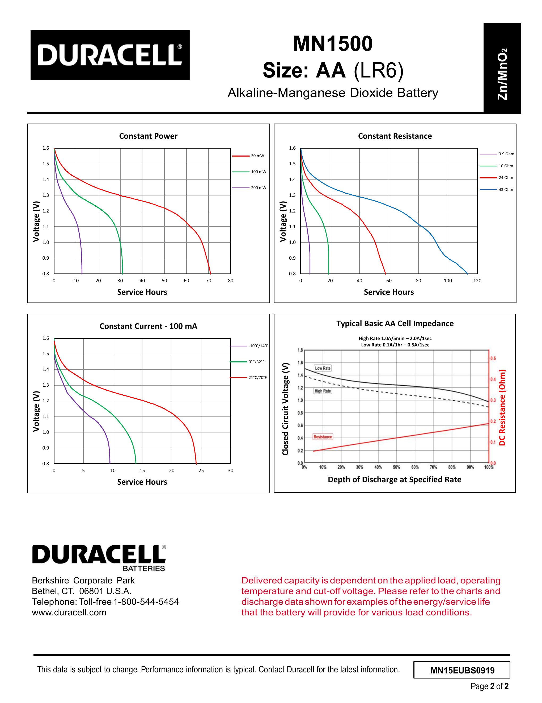

# Power measurements

This document gives the evidence for the battery life in the README. It also
tells you how to measure your own device.

## The instrument

The measurements use a [Nordic Power Profiler Kit II
(PPK2)](https://www.nordicsemi.com/Products/Development-hardware/Power-Profiler-Kit-2).
The PPK2 is a USB power analyzer. In source-meter mode it supplies the board at
a set voltage between 0.8 V and 5 V. At the same time it measures the current
from 200 nA to 1 A, at 100,000 samples per second.

That range is important. One trace shows both a 92 µA sleep current and a 1.6 A
boot surge. A battery life number is therefore a measurement, not an estimate.

**You do not need a PPK2 to use this firmware.** The build process and the flash
process do not use it. You need it only for two tasks: to repeat these
measurements, or to diagnose a device that loses charge too fast.

## One wake


The selection shows one complete wake: 2.926 seconds at an average of
199.19 mA. The charge is 0.58 C. The peak of 1.63 A is the radio start.

The reference wake cost is **0.158 mAh**. All battery life numbers below use
this value.

## Standby current of the fleet

Six devices, measured at 1800 mV. The day columns show the battery life for
each sleep interval, with a 2500 mAh alkaline AA cell.

| Unit | Standby | Normal, 12/day | Almost Dry, 24/day | Dry, 6/day | Grade |
|---|---:|---:|---:|---:|---|
| 1 | **92 µA** | 608 days | 416 days | 791 days | Healthy |
| 2 | **91 µA** | 613 days | 419 days | 799 days | Healthy |
| 3 | **96 µA** | 596 days | 410 days | 770 days | Healthy |
| 4 | **88 µA** | 622 days | 423 days | 815 days | Healthy after repair |
| 5 | **163 µA** | 430 days | 324 days | 514 days | Acceptable, small leak |
| 6 | **92 µA** | 608 days | 416 days | 791 days | Healthy after repair |

Units 4, 5 and 6 had water damage. Refer to
[hardware-notes.md](hardware-notes.md) for the cause and the repair.

## How to calculate the battery life

Two terms control the battery life: the standby current, and the cost of each
wake.

```
daily mAh = standby_uA x 24 / 1000  +  wakes_per_day x 0.158
battery days = 2500 / daily mAh
```

For a healthy device at the Normal Moisture interval:

```
standby : 92 x 24 / 1000 = 2.21 mAh/day
wakes   : 12 x 0.158     = 1.90 mAh/day
total   :                  4.11 mAh/day
life    : 2500 / 4.11    = 608 days
```

Substitute your own standby current and your own interval. The standby current
is about 54% of the budget on a healthy device. On a damaged device it is more
than 95%, which is why a leak is more important than any firmware change.

## Battery percentage

The firmware publishes the raw battery voltage. It calculates the percentage
from a lookup table, not from a linear map.

| Cell voltage | 1.60 | 1.50 | 1.40 | 1.30 | 1.20 | 1.10 | 1.00 | 0.90 |
|---|---:|---:|---:|---:|---:|---:|---:|---:|
| Reported % | 100 | 96 | 83 | 57 | 24 | 11 | 3 | 0 |

### Which curve, and why

Duracell publish more than one AA datasheet, and the discharge curves differ.
The values above come from one specific chart:

> **Duracell Basic AA (MN1500 / LR6)**, document `MN15EUBS0919`, page 2,
> "Constant Power" chart, the **50 mW** curve. Get it from the [Duracell product
> technical data sheets](https://duracell.com/techlibrary/product-technical-data-sheets).



The **Coppertop** AA datasheet (`MN15USCT0122`) is the better known document,
but it is the wrong one here. Its lightest constant-power curve is 250 mW. The
Basic datasheet is the only one that publishes a 50 mW curve.

The load decides which curve to use. This device draws about **4.11 mAh each
day** at the Normal interval. That is an average of 171 µA, or about
**0.26 mW** at 1.5 V.

| Curve | Load compared to this device |
|---|---:|
| Basic AA, 50 mW | 195x heavier |
| Coppertop AA, 250 mW (its lightest) | 973x heavier |

The 50 mW curve is therefore the closest published curve, but it is still much
heavier than the real load. This makes the percentage **conservative**. A light
load gives an alkaline cell more usable service than a heavy load. A real device
should therefore do at least as well as the table shows.

The shape of the curve matters here, not the capacity. The table maps a voltage
to a percentage of service, so it is normalized to the 0.9 V cutoff of the boost
converter. A Coppertop cell holds more charge than a Basic cell. The percentage
still reads correctly. A heavier load changes the shape of the curve. A
different cell grade mostly changes its length.

An alkaline cell does not discharge in a straight line. A linear 1.2 V to 1.5 V
map holds a new cell at 100% for several weeks. It then crosses the whole scale
in about twelve days. The map also reports 0% at 1.2 V, where about 24% of the
usable service remains.

The percentage is still an estimate. Temperature, cell age, pulse impedance and
recovery time all move the terminal voltage. The ADC of the ESP32-C6 also has
an error. Use the percentage for alerts. Use the raw voltage for a diagnosis.

## How to measure your own device

### Connections

Use source-meter mode. The PPK2 supplies the board.

```
PPK2 VOUT --> AA holder +        PPK2 GND --> AA holder -
VIN unconnected                  AA cell removed from the holder
USB cable disconnected
```

The USB cable must stay disconnected. The firmware holds the device awake while
a USB host is present, so a connected cable hides the standby current.

### Supply 1800 mV, not 1500 mV

The AA cell is nominally 1.5 V, but you must set 1800 mV.

The boot surge is more than 1 A. That is the maximum current of the PPK2. At
1.5 V the supply cannot hold the rail, the voltage falls, and the chip enters a
brownout loop. **A capture with an average of several hundred mA is a reboot
loop. It is not data.**

The loads are constant power. To compare two supply voltages, scale the current
by 1/V.

### Commands

A pass or fail check takes about 55 seconds:

```bash
uv run tools/ppk2-monitor.py diag --label "plant 1"
```

A full capture and analysis:

```bash
# Linux / macOS
uv run tools/ppk2-monitor.py measure --volt 1800 --seconds 90 --settle 45 --csv /tmp/plant1.csv
uv run tools/analyze-capture.py /tmp/plant1.csv 1800
```

```powershell
# Windows
uv run tools/ppk2-monitor.py measure --volt 1800 --seconds 90 --settle 45 --csv c:/temp/plant1.csv
uv run tools/analyze-capture.py c:/temp/plant1.csv 1800
```

Write the CSV outside the repository. At 100,000 samples per second, a 90 second
capture is about 170 MB.

Both scripts run on Windows, Linux and macOS. They need no serial port name,
because the PPK2 uses its own USB interface.

### Verdict bands

The grade compares the measured standby current to the 92 µA baseline.

| Ratio | Verdict |
|---|---|
| Below 1.25x | Healthy |
| 1.25x to 2x | Acceptable |
| 2x to 4x | Marginal |
| 4x to 10x | Damaged |
| 10x or more | Severely damaged |

### Cautions

- **Compare the means, not the medians.** The boost converter changes between
  burst mode and continuous mode with the input voltage. The medians of one
  unit differed by 3x between 1.8 V and 1.5 V. The means agreed within 11%.
- **Discard the first 20 seconds after the device sleeps.** The output capacitor
  still holds charge, so the boost converter has not started to burst. One unit
  read 351 µA immediately after sleep, and 496 µA when settled. The `diag`
  command discards 20 seconds by default.
- **The script reads 5% to 8% below the Nordic application.** The application
  also compensates the auto-range switch, which the script cannot do. Use the
  script for ratios. Use the application for absolute values.
- **Close the Power Profiler application first.** One process can hold the
  serial port. The PPK2 also drops its output each time the serial session
  opens again.
